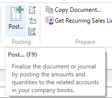

# Recurring Invoicing in NAV - Demonstration

A new customer has signed up for our services end May. 
We are going to invoice him for the last six months of the year. 
The subscription starts repeating itself the following year.

## Set Working Date

Set the Work Date to 29/05/2019.

## Subscription Service Item 

We have already setup an Item of Type Service, with a Recurring Subscription Type and a Periodicity of one year (`1Y`). 

Find it in the list. 

And open the Item Card.

We have set the following values since they are important to the following steps.

- Type: Service
- Subscription Type: Recurring
- Subscription Periodicity: 1Y
- Unit Price: 1000,00

When we add the Yearly Subscription to an Blanket Order Line, these values are copied automatically. 

## Blanket Order

Create a Blanket Order and add the three lines below. Only the last line will be recurring.

- The first line is an one time only entry fee. 
- The second line is the one time subscription for the rest of the year. 
- The third line is the recurring subscription starting the following year. 
- Blank the Subscription Type on the two first lines manually. 
- The Periodicity is cleared automatically.
- The Shipment Date manages when the Order will be created.
- Set the Shipment Date on the last line to the 1st of January the following year. 
- Set the Quantity to Ship to zero to put it onhold. This ensures that the Make Order function ignores the lines until you set it. The function Calculate the Quantity to Ship will set it, as we shall see next. 

Click the function Calculate the Quantity to Ship on the Blanket Order Header.

This will automatically set the Quantity to Ship on all the lines where the Shipment Date is today or earlier and where the Quantity to Ship is zero. This is to ensure control over when the subscription order is created. 

The Quanity to Ship has been set on the two first lines, but not on the last because its Shipment Date is in the future. 

Click the function Make Order.

Click Yes to confirm the creation of the order.

Find the Order that was created.

Click Post to invoice the order.

Click OK to Ship and Invoice.

Click Yes to open the Posted Invoice.

Go back to the Blanket Order and see that the Quantity Shipped and Quantity Invoiced fields have been updated.

It is now possible to prepare the following subscription period. 

Close the Blanket Order for now. 

Set the the Work Date to 01/01/2020. 

Then open the Blanket Sales Orders list. 

Click the function Calculate the Quantity to Ship.

This will launch the Batch Job. It will run through all the Blanket Sales Orders to set the Quantity to Ship. 

Open the Blanket Order. 

The Quantity to Ship has now been set to 1 on the Subscription line. 

Go ahead and do the following steps

- Make the Order
- Invoice the Order
- Go back to the main page.
- Set the Work Date to 10/01/2020.

We are now in the beginning of January 2020.

We can prepare the subscriptions for 2021 at any time. Let us do it now. 

Click the function Calculate Next Subscription Period. 

A new line has been added to the Blanket Order. The Quantity to Ship is zero and thus the line is on hold until we call the function Calculate Quantity to Ship on Subscriptions.

Unfortunately, the customer calls us to put the subscription on hold.

Change the Subscription Type to Stop on the last line.

# Functions

## Batch Jobs

The three important functions are on both the Blanket Order Header and on the list of Blanket Orders. 

- We presume that the Quantity to Ship is zero. This means that the Make Order Batch Job can be run at any time without any consequences. 
- Once the Calculate Quantity to Ship is run, we can check the subscriptions before we call the Make Order. You can execute the Make Order from an individual Blanket Order or an several Blank Orders as a Batch Job. 
- Once the orders have been created, you will have to invoice them using the usual invoicing process. 
- When ready for the following subscription period, you can run the Calculate Next Subscription Period. 

The system has been designed so you can run this procedure every day or as often as you like. A Shipment Date in the future is simply ignored by the function. 

