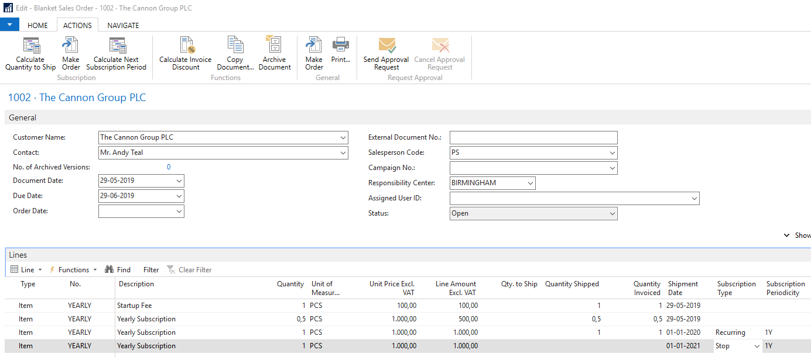

# Recurring Invoicing using Blanket Orders

A simple yet complete recurring invoicing solution made by adding only two fields and two functions to the Blanket Order.

- New Fields on Item and Sales Line
  - Subscription Type
    - Blank (normal, as standard)
    - Recurring (automatically calculating next period)
    - Stop (invoicing put on hold or cancelled)
  - Subscription Periodicity
    - Any date formula, but typically
      - 1Y, 1Q, 1M
    - It calculates the next shipment date.
- New Functions on Blanket Order
  - Calculate Quantity to Ship + Batch Job
  - Calculate Next Subscription Period + Batch Job
- Standard Functions involved
  - Make Order from Blanket Order + New Batch Job
  - Post Order (Batch Job exists in standard)

Each customer typically has one contract. The Blanket Order acts as the Contract. It keeps track of the Items that the customer has subscribed to in the past, currently and possibly in the future. This makes support of the customer easy.

## Invoicing a onetime fee

To invoice an entry fee together with the recurring items, Set Quantity to Ship and leave the Subscription Type blank.

## Invoicing the last three months of the year prorate

To invoice the last three months of the year prorate, type 1/4 in the Quantity field. The Quantity to Ship is filled in automatically. Leave the Invoicing Type blank.

## Prepare the Invoicing of the Following Period

Prepare the following complete period by adding a new line with the Quantity filled in. Clear the Quantity to Ship field by setting it to zero. Set the Invoicing Type to Recurring and the Invoicing Periodicity to normal period length. For example `1Y` (1 Year).

## Cancel the Subscription

Set the Subscription Type to `Stop` to stop the recurring invoicing or to put it on hold. This will set the Quantity to Ship to zero and avoid the creation of new Subscription lines. When the Quantity to Ship is zero, then the line is ignored by the Make Order function. If you want to invoice this last line, then set the value in the Quantity to Ship.

The Subscription Periodicity is not reset, since it might be useful if the Customer would like to continue the Subscription later.

# Functions

##

## Make Order

The standard function Make Order creates a new order with one line for each line in the Blanket Order with a Quantity to Ship different from zero.

Then invoice the orders with the standard procedure. The field Quantity Invoiced on the Blanket Order is updated automatically.

## Calculate Quantity to Ship

The Quantity to Ship is zero until we are ready to invoice. Run the function Calculate Quantity to Ship to set the Qty to Ship field on the lines.

Note that only lines where the Shipment Date is not in the future are taken into account. Therefore, you can use this function in the beginning of each period or every day.

Once you have calculated the Quantity to Ship, you use the function Make Order above to create an order that is then posted to create the invoice.

## Calculate Next Subscription Period

When the current order lines have been invoiced and the Invoicing Type is still recurring, then this function adds a new line to the Blanket Order for the following period. The Shipment Date for the follow period is calculated by adding the Subscription Periodicity Formula to the current Shipment Date.

The new line has no value in the Quantity to Ship field, which means that it will not be put on an order before you call the function Calculate Quantity to Ship and then call the Make Order function.

# Batch Jobs

You use these Batch Jobs to facilitate the handling of thousands of contracts.

# Setting up the Recurring Invoicing on Items

Setup the default Subscription Type and Subscription Periodicity on the item card. When you add the item to the Blanket Order, these values are copied to the Blanket Order Line.

# Recurring Sales Order Lines Views

Should Display a list of all Sales Order Lines with Recurring Subscription Type.  
